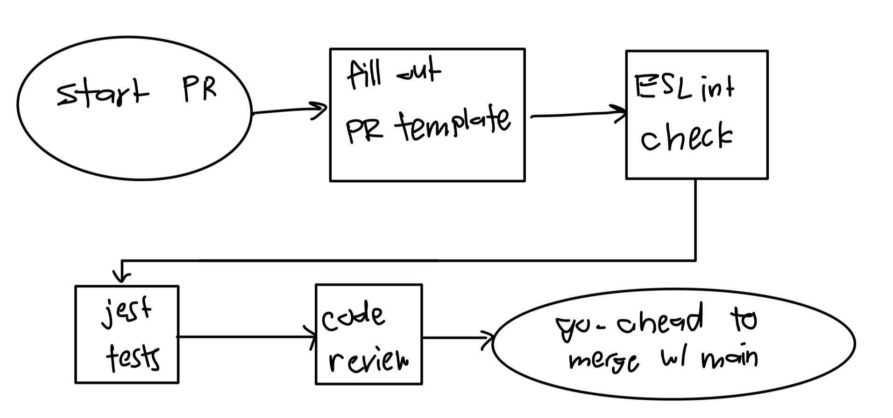

# Phase 1
For Phase 1 of our pipeline, the fundamental functional aspects we sought to start with were:
- Common template for pull requests
  - We sought to have a common structure to creating and reviewing pull requests, as it would make things easier for the reviewers in terms of analyzing the efficacy of the request.
- Request structure involves
  - Section titled “Tracking Info” to communicate purpose of PR, particularly referring to which issue is being resolved
  - Section titled “Changes” where the developer details the exact changes made in the code in terms of their functionality relating to the issue
  - Section titled “Testing” to better understand how thorough the testing of the code was done.
    - This helps the reviewer get a better picture of the code’s impact on a sample.
  - Section titled “Confirmation of Change”
   - Consists of multiple screenshots, one corresponding to a failing case and not being able to merge, other corresponding to a passing scenario. Fully visualizes use cases of the code with regards to repo structure
- ESLint testing during pull request creation
  - Helps with pattern recognition among code branches, and helps maintain consistency with code
  - We went with `eslint:recommended` ruleset and the exact rules can be found [here](https://eslint.org/docs/latest/rules/)
- Jest
  - We are using jest as our unit testing framework to confirm that our javascript works and continues to work with each addition to our codebase
- Code quality via human review
  - Each pull request will have at least one human reviewer to look over the code for any quality errors or unnecessary lines
  - Unnecessary `console.logs` will be removed
  - Formatting errors not caught by ESLint will be fixed
  - Will leave written feedback if any changes are requested

# Phase 2
In Phase 2 of our pipeline, we plan on using code scanning with SonarCloud and implementing JSDocs for documentation. We have started both processes but have not fully implemented them yet.

# Phase 1 Diagram

