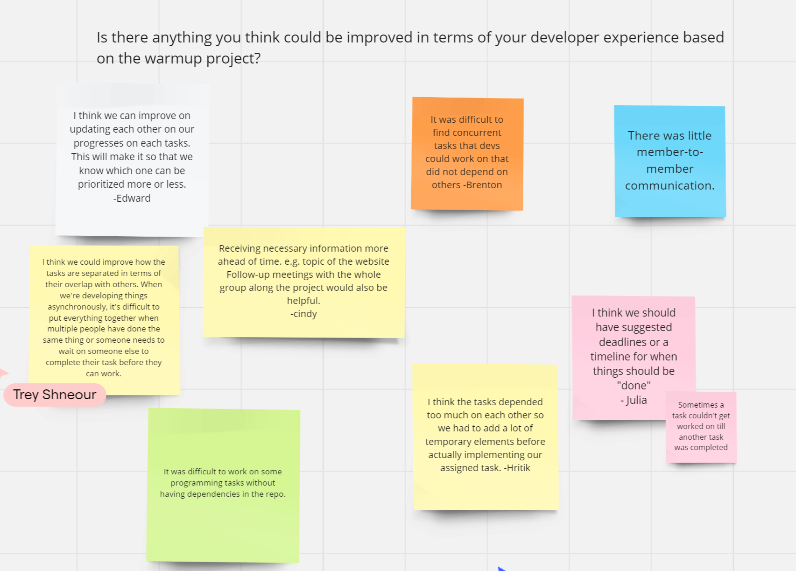
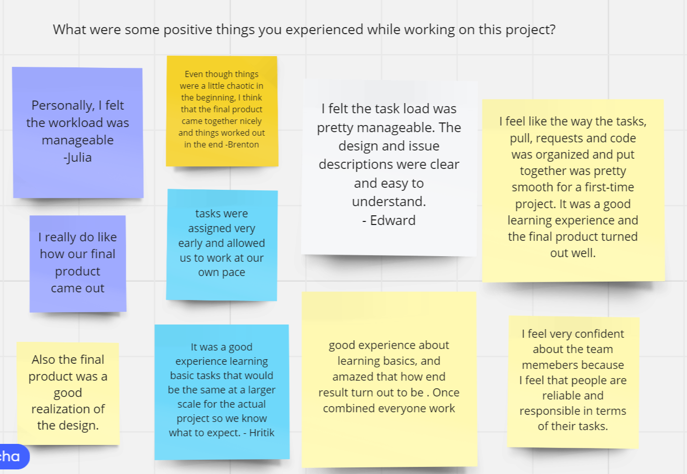
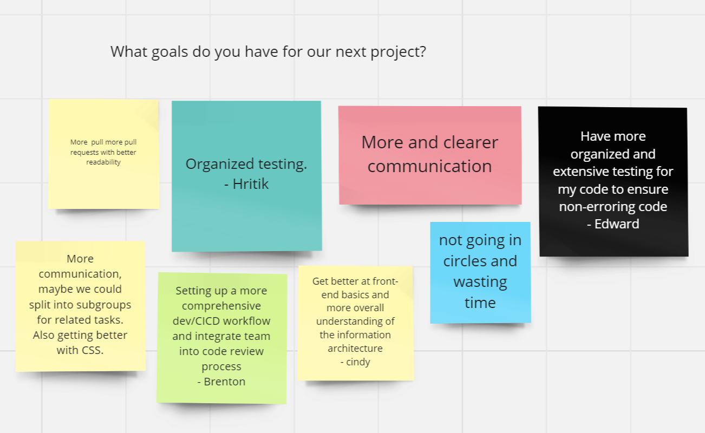

# 042924-retrospective

Location: Zoom

Date: 04/29/2024

Start time: 7:30 PM

End time: 8:00 PM

## Attendance:

Team members present: 
- Advaith Modali
- Alex Yang
- Brenton Dunn
- Cindy (Huimeng) Lu
- Dylan Tran
- Edward Lin
- Hritik Bharucha
- Julia Berdeski
- Sujen Kancherla
- Trey Shneour

Team members absent: 
- Ali Alani

## High Points

### Agenda
- Brenton announced his dev workshop that allows members to be more familiarized with the process and technology used.
- Created a Miro board to gather team thoughts

 

- Asked about opinions on improvements that could've been made for the warmup
    - 

    - Common opinions on improvements from the board:
        - Improvement of communication for what has been done in each issue 
        - Some tasks overlapped, meaning they relied on another to be finished before the other.
        - Clear deadlines and a timeline for tasks

- Asked about positive experiences in the warmup
    - 

    - Common positive experiences:
        - Workload was manageable and there weren't too many issues assigned
        - Great way to learn the basics of HTML, CSS, and JS
        - The final product came out well and matched the design
    
- Discussed future goals
    - 

