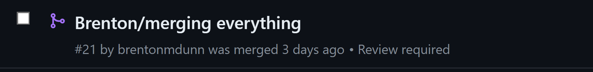
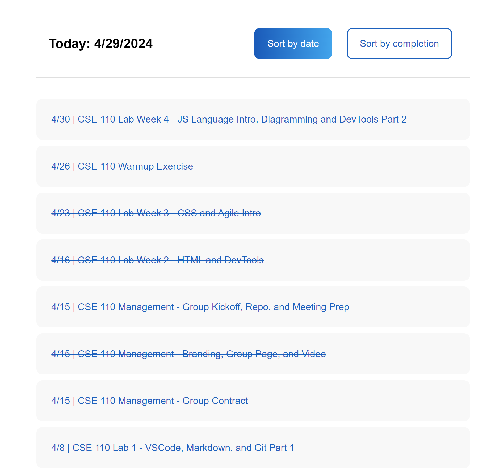
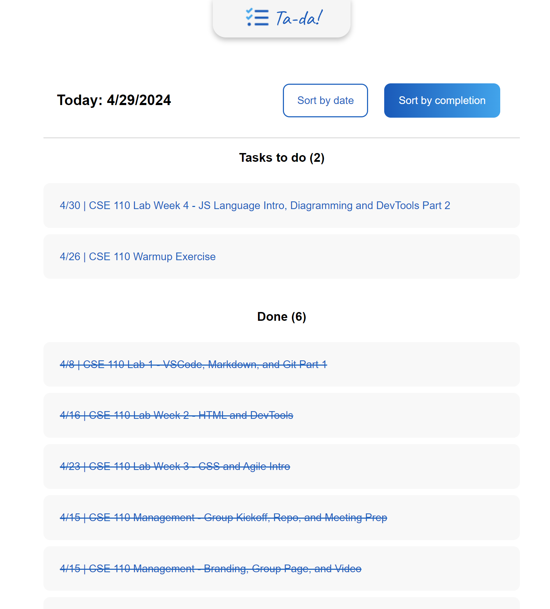
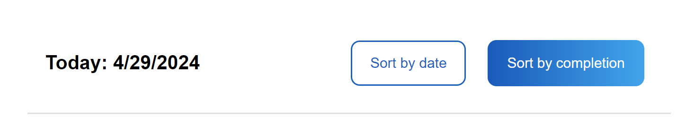
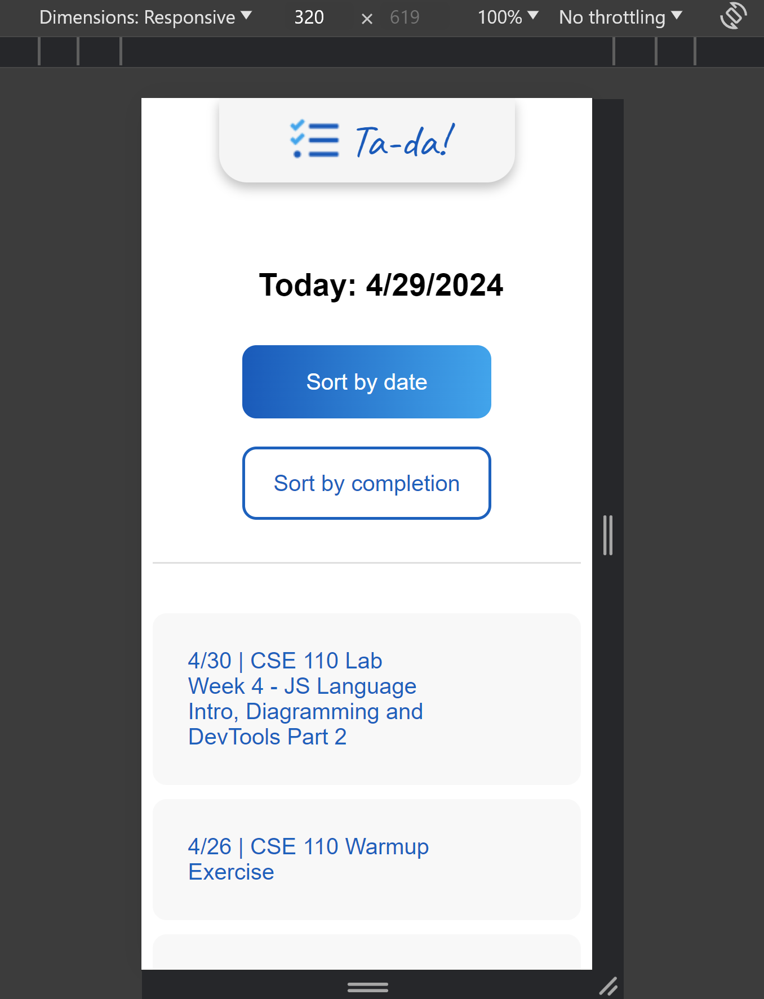
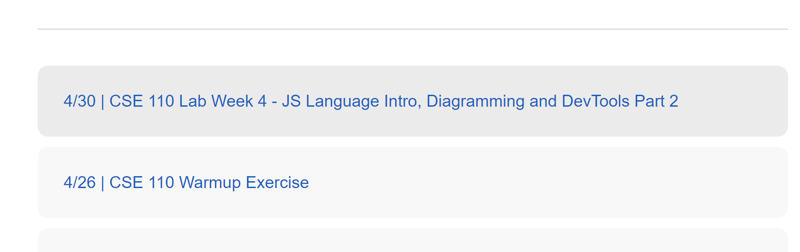
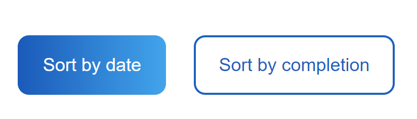
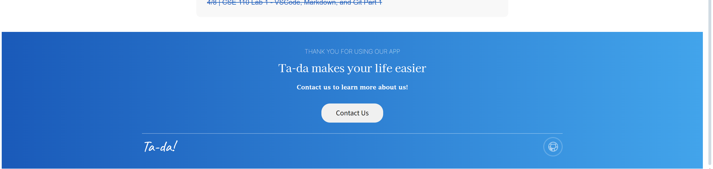
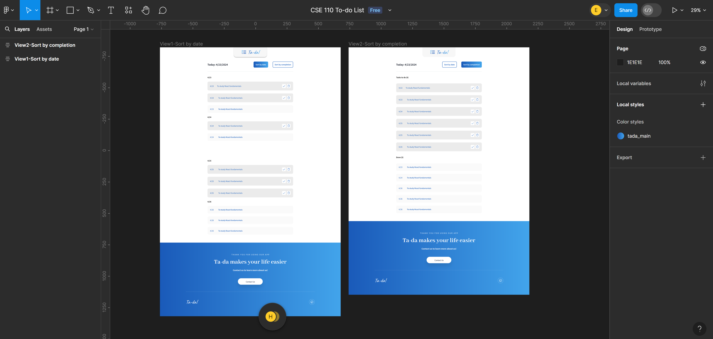

# 042924-042924-sprint-1-review

Location: Zoom

Date: 04/29/2024

Start time: 7:00 PM

End time: 7:30 PM

## Attendance:

Team members present: 
- Advaith Modali
- Alex Yang
- Brenton Dunn
- Cindy (Huimeng) Lu
- Dylan Tran
- Edward Lin
- Hritik Bharucha
- Julia Berdeski
- Sujen Kancherla
- Trey Shneour

Team members absent: 
- Ali Alani

## High Points

### Brenton Dunn
- Administrative Role
- Scope Review PRS
- Merge Branches
- Ingegrated and merged everyone's branches

### Advaith Modali
- Looking over PRs
- Helping with GitHub problems
- Finish PRs to populate table by date

### Dylan Tran
- Finished PR to make website top navbar
    - Multiple versions to iterate to final design

### Edward Lin
- Finished PR to populate table by completed state
- Changed header title to match Figma's design of having the date and buttons in a row
- Fixed bug where strikethrough for tasks was incorrectly colored
- Organized the css file into individual files by component

### Alex Yang
- Create original header of website 
- Styled the original header to align them properly in the center

### Hritik Bharucha
- spacing and margins for tablet and mobile screens
    - used media queries to allow for responsiveness

### Julia Berdeski
- Styled the table to match the Figma's design
    - Add hover style on tasks
    - Centered the title

### Sujen Kancherla
- Styled the button to match the Figma's design

### Trey Shneour
- Create and style footer to match the Figma's design
    - Imported custom fonts
- Add links to github for contact us 

### Cindy (Huimeng) Lu
- Designed the website by creating the file on Figma
- Created all assets, logos, and fonts

