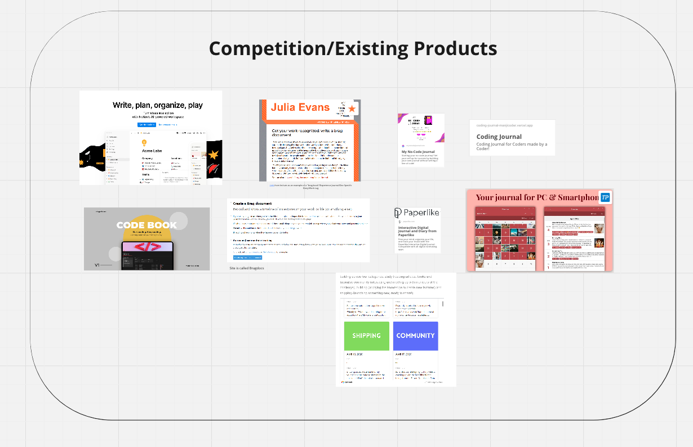
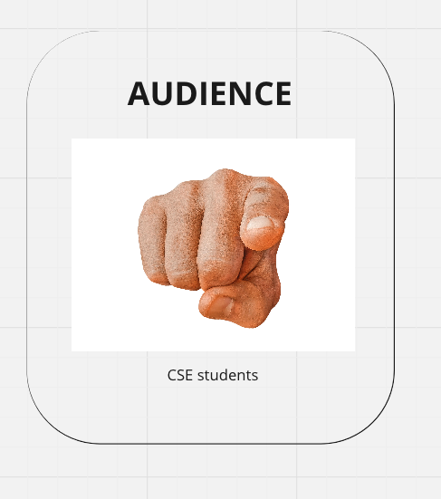
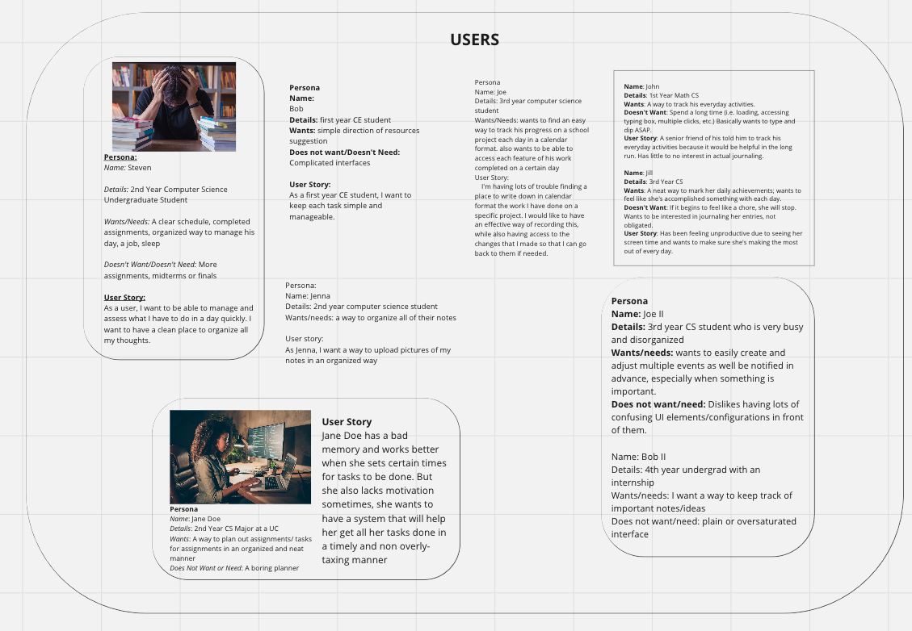
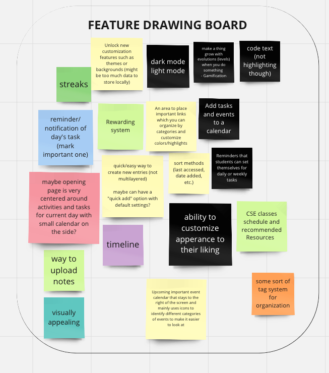
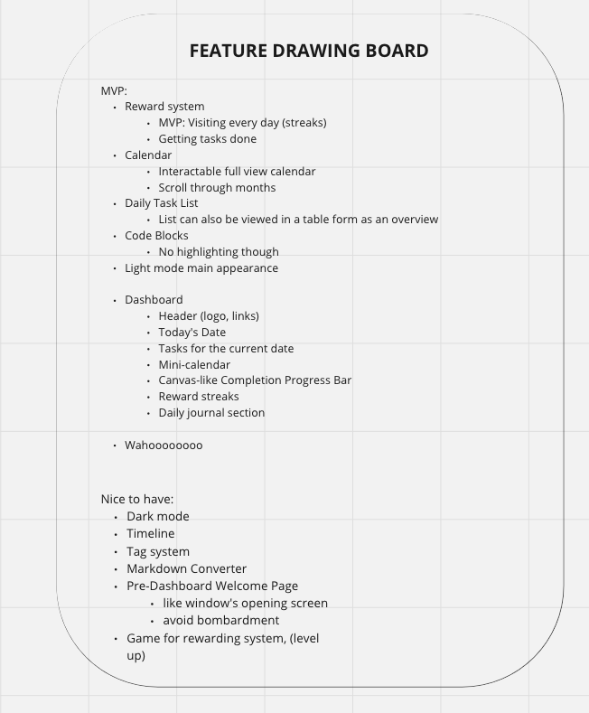
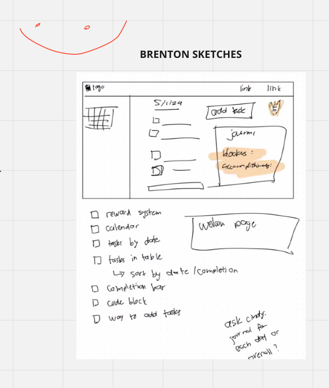
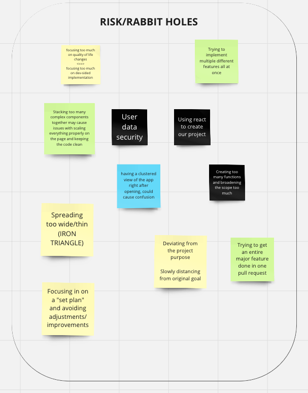

# Brainstorming

## Attendance

Start time: 7:31 PM

End time: 9:20 PM

Format: Zoom

Members present:
- Brenton Dunn
- Advaith Modali
- Dylan Tran
- Trey Shneour
- Alex Yang
- Edward Lin
- Hritik Bharucha
- Julia Berdeski
- Sujen Kancherla

Members not present: 
- Ali
- Cindy 

## Notes
- Audience
  - Main ones we are deciding between:
    - Students
    - Hobbyists
    - Enterprise
  - Decision: students who code 
- Technology
  - Decision: stick to Vanilla JS not React due to learning curve and relevancy to in-class material
## Miro Board

