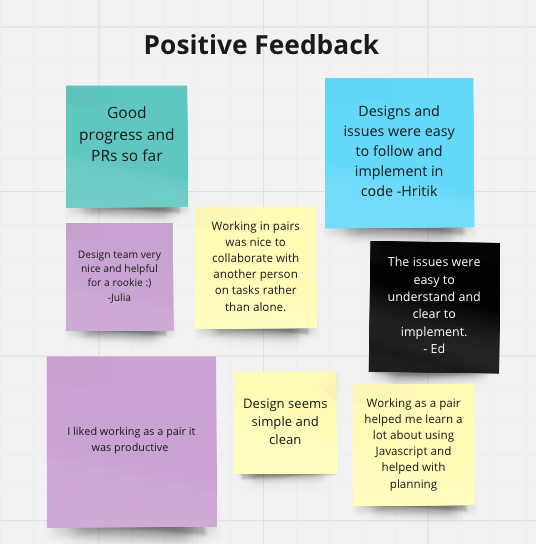

# Project Sprint 1 Review + Sprint 2 Planning

Start time: 6:00 PM

End time: 6:55 PM

Recording info:  
[https://ucsd.zoom.us/rec/share/v8-jz8XhkrMDL09GUHGWQxvdpcqidLIHx1p9wpJzwAXm9q9ZCGQUtrEQAey_hDVw.oyIZCz5OuGLFTrO7](https://ucsd.zoom.us/rec/share/v8-jz8XhkrMDL09GUHGWQxvdpcqidLIHx1p9wpJzwAXm9q9ZCGQUtrEQAey_hDVw.oyIZCz5OuGLFTrO7)
Passcode: #^45pHkH 

Members present: 
- Advaith
- Alex
- Ali
- Brenton
- Edward
- Hritik
- Julia
- Sujen
- Trey

Members not present:
- Dylan
- Cindy

## Agenda

- Sprint review/retrospective

  
- Sprint 2 planning + updates
  - Add features into its own folder (so js and css should be in its own folder)
  - Leads will put tasks and you assign it to yourself
    - Can work if pairs or solo
