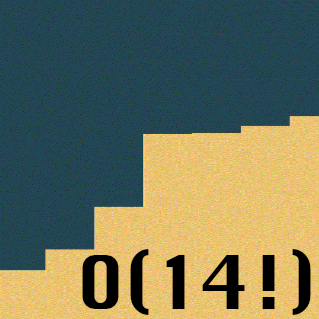

# Welcome to Team Bozosort

We value:
- Responsibity
- Honesty
- Communication
- Effeciency
- Psychological safety 
- Having a fun time

Things don't always have to be optimal--they just have to work eventually :D
# Roster
1. Brenton Dunn (Lead) | [GitHub](https://github.com/brentonmdunn)
  - 2nd year Computer Science major
  - Hobbies: photography and listening to podcasts
2. Advaith Modali (Lead) | [GitHub](https://github.com/advaithm22)
  - 2nd year Computer Engineering major.
  - Hobbies: playing the guitar as well as watching football and basketball
3. Sujen Kancharla | [GitHub](https://github.com/sujen07)
  - 3rd year Data Science student
  - Hobbies: likes to play soccer 
4. Dylan Tran | [GitHub](https://github.com/dylantrann)
  - 2nd year Computer Science major
  - Hobbies: watching anime and cooking
5. Hritik Barucha | [GitHub](https://github.com/hritikbharucha)
  - 3rd year CS major
  - Hobbies: working out and playing basketball
6. Julia Berdeski | [GitHub](https://github.com/jberdeski)
  - 2nd year CS major
  - Hobbies: going to Padres games and cooking
7. Edward Lin | [GitHub](https://github.com/EdwardLinS)
  - 2nd year CS major
  - Hobbies: listening to music and is currently a tutor for CSE 100.
8. Cindy Lu | [GitHub](https://github.com/HuimengLu)
  - 3rd year Math-CS and Design major
  - Fun fact: fostered two cute litle puppies
9. Alex Yang | [GitHub](https://github.com/OasisAlex)
  - 3rd year CE major
  - Fun fact: has a kitten
10. Ali Alani | [GitHub](https://github.com/a3alani)
  - 3rd year CE major
  - Hobbies: likes to play football (soccer)
11. Trey Shneour | [GitHub](https://github.com/tshneour)
  - 2nd year CS major
  - Fun fact: helped make a game that you can play on an arcade machine here at UCSD

