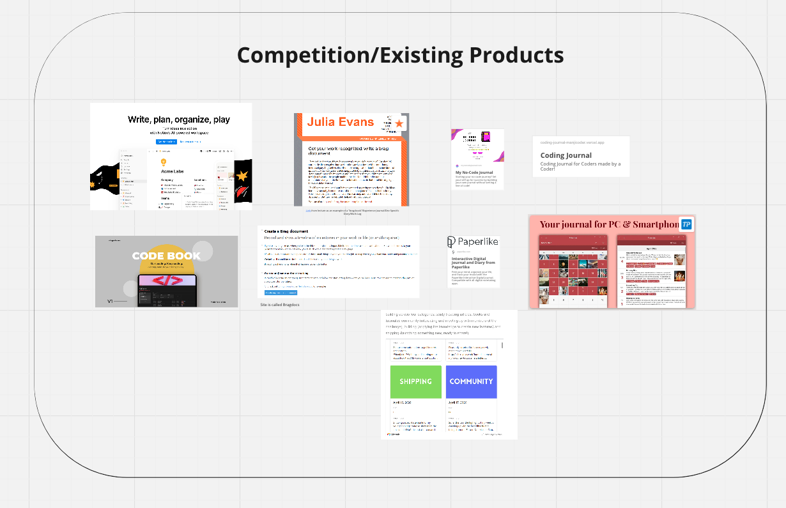
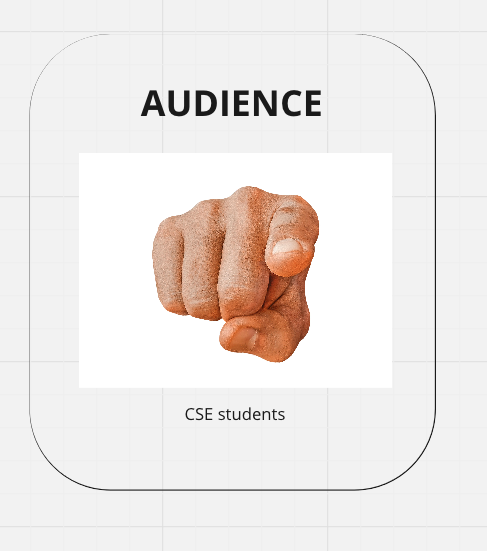
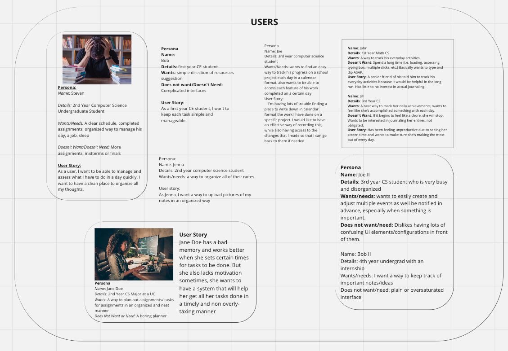
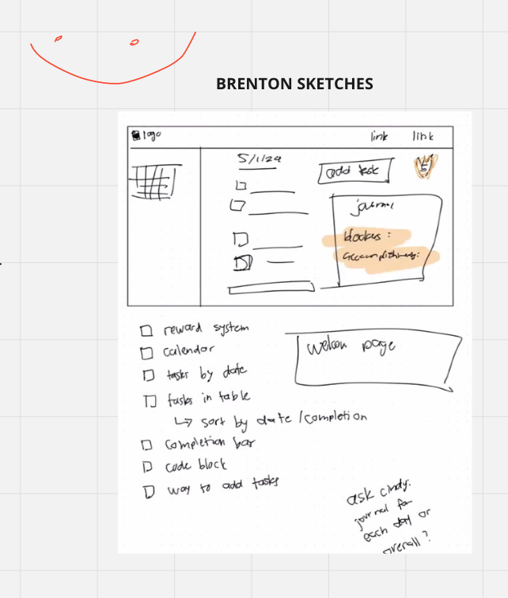
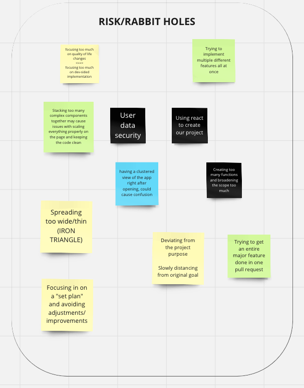

# Project Pitch

## Table of Contents
- [Project Pitch](#project-pitch)
  - [Table of Contents](#table-of-contents)
  - [Statement of Purpose](#statement-of-purpose)
  - [Comptition/Existing Products](#comptitionexisting-products)
  - [Audience](#audience)
  - [Users](#users)
  - [Features](#features)
  - [Sketch](#sketch)
  - [Risks/Rabbit Holes](#risksrabbit-holes)

## Statement of Purpose

The goal of this project is to create a multipurpose coding journal that can be used to keep track of items and also be tailored to specifically help students who code. Our product aims to assist with task-tracking for students while also having nice quality of life features to help people who code.

## Comptition/Existing Products

We decided to look for products that were used for task tracking and that also maybe included developer-specific features. Some of the products we found included:
- Notion (Code book)
- My No-Code Journal
- Julia Evans blog  on a dev journal

## Audience

We were deciding between three different audiences: students who code, hobbyist developers, and enterprise customers. We decided to go with students who code because we know the audience and needs of the audience the best.

## Users

We came up with a series of personas and user stories.

> Persona:
Name: Steven
Details: 2nd Year Computer Science Undergraduate Student
Wants/Needs: A clear schedule, completed assignments, organized way to manage his day, a job, sleep
Doesn't Want/Doesn't Need: More assignments, midterms or finals 
User Story:
As a user, I want to be able to manage and assess what I have to do in a day quickly. I want to have a clean place to organize all my thoughts.

> Persona
Name: Bob
Details: first year CE student
Wants: simple direction of resources suggestion
Does not want/Doesn't Need: Complicated interfaces 
User Story:
As a first year CE student, I want to keep each task simple and manageable.

> Persona:
Name: Jenna
Details: 2nd year computer science student
Wants/needs: a way to organize all of their notes
 User story:
As Jenna, I want a way to upload pictures of my notes in an organized way

> Persona
Name: Jane Doe
Details: 2nd Year CS Major at a UC
Wants: A way to plan out assignments/ tasks for assignments in an organized and neat manner
Does Not Want or Need: A boring planner  
User Story
Jane Doe has a bad memory and works better when she sets certain times for tasks to be done. But she also lacks motivation sometimes, she wants to have a system that will help her get all her tasks done in a timely and non overly-taxing manner

> Persona
Name: Joe
Details: 3rd year computer science student
Wants/Needs: wants to find an easy way to track his progress on a school project each day in a calendar format. also wants to be able to access each feature of his work completed on a certain day 
User Story:
I'm having lots of trouble finding a place to write down in calendar format the work I have done on a specific project. I would like to have an effective way of recording this, while also having access to the changes that I made so that I can go back to them if needed.

> Persona
> Name: John
Details: 1st Year Math CS
Wants: A way to track his everyday activities.
Doesn't Want: Spend a long time (i.e. loading, accessing typing box, multiple clicks, etc.) Basically wants to type and dip ASAP. 
User Story: A senior friend of his told him to track his everyday activities because it would be helpful in the long run. Has little to no interest in actual journaling.

> Name: Jill
Details: 3rd Year CS
Wants: A neat way to mark her daily achievements; wants to feel like she's accomplished something with each day.
Doesn't Want: If it begins to feel like a chore, she will stop.
Wants to be interested in journaling her entries, not obligated.
 User Story: Has been feeling unproductive due to seeing her screen time and wants to make sure she's making the most out of every day.

> Persona
Name: Joe II
Details: 3rd year CS student who is very busy and disorganized
Wants/needs: wants to easily create and adjust multiple events as well be notified in advance, especially when something is important.
Does not want/need: Dislikes having lots of confusing UI elements/configurations in front of them.

> Persona
> Name: Bob II
Details: 4th year undergrad with an internship
Wants/needs: I want a way to keep track of important notes/ideas
Does not want/need: plain or oversaturated interface

## Features

We wanted our project to include features that helped with task tracking and also were specific to developers. Some of the features we want to include in MVP include:
- Reward system to get tasks done
- Calendar
- Daily task list
- Code block integration (no syntax highlighting)
- Light mode appearance
- Dashboard

Some features we brainstorted for V1 after MVP inlude:
- Dark mode
- Tag system
- Timeline
- Markdown converter

## Sketch

Here is a very preliminary sketch of our project interface. Our designer is still working on more detailed sketches which will be shown during the TA standup.

## Risks/Rabbit Holes

Some of the risks and rabbit holes that we brainstormed included:
- Deviating too much from original scope/adding too much scope
- Confusing UI/UX
- Creating technical debt

